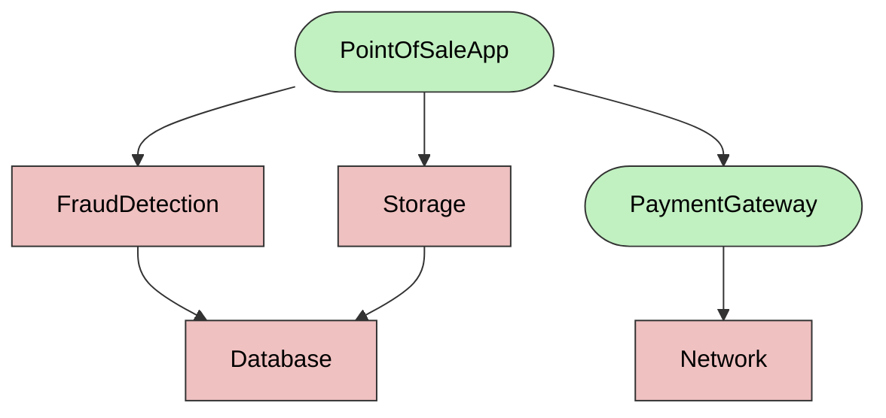

# Color Coding your Code

[](https://hackmd.io/v4y2FQBoRQuPiXOqNbW7DQ)

There are many ways to categorize code, and no single categorization is perfect. Each approach is useful in certain contexts, so view the categorization in this book as a helpful lens rather than the definitive way. 

Code can do virtually anything, but when code lacks clear boundaries, it becomes difficult to reason about, refactor, and test. We call such code non-malleable or non-modular. To address this, we apply "best practices" that organize code in ways to help our understanding.

In this book, we categorize code into four main types based on testability and modularity. Think of this as a color-coding system where code ranges from highly "pure" (strict rules) to completely "unbound" (no restrictions). An important principle: if well-behaved code depends on less-behaved code, the well-behaved code becomes tainted. This contamination is contagious—your code inherits the constraints of its least constrained dependencies.

* 🟢 **Pure**: Pure code depends only on its inputs and produces no side effects. It always returns the same output for the same input. It is well-behaved.
* 🟡 **Effect**: Side effect (or effect) code (in contrast to pure) interacts with the external world by depending on the global state, or affects the global state.
* 🔵 **Provider**: The provider is responsible for assembling a graph of objects for different environments. By keeping providers separate from Effects, you can swap implementations (e.g., use a real database in production, a mock in tests).
* ⚫️ **Unbound**: Test code is used to create the code under test, apply a stimulus, and assert its output.

We split the code into its colors because we apply different rules to each color. These rules guide us in understanding:

- How we should think about the code
- How we should discuss it with other engineers
- How it should be assembled into a working application

## Pure

Let’s start with the simplest piece of code for testing, a pure function. A pure function is one whose output depends only on its input; specifically, it does not modify any global state and is therefore side-effect-free. 

Here is an example of a pure function where the output of the function depends only on the function's input:

```ts
// @pure
function add(a: int, b: int) {
  return a + b;
}
```

> NOTE: Throughout the book, we will leave annotations (such as  `// @Pure`) to signify the intent of the code. 

If you are doing functional programming, the above definition suffices, but for object-oriented code, we need to define what pure code is. Pure code is similar to a pure function in that its output depends only on its input, but it can also extend to the concept of objects.

### Scope

When discussing whether code is pure, it is important to realize that it is scope-dependent. For example `a + b` may look pure, but if you zoom in, you realize that 
At the CPU register level, it has a side effect of destroying register values, yet we consider it pure because we know the compiler will generate all the necessary code to make it appear pure, so we treat it as such.

The important point to understand is that when we talk about "pure," we always need to ask with reference to what.
- `a + b` has side effects with respect to registers
- but `a + b` is pure with respect to statements around it.

Similarly, is a `set(key, value)` function on a `Map` pure? Well, it certainly has side effects; it mutates the `Map`. But look at this code:

```ts
function testMapSet() {
  var map = new Map<string, int>();
  map.set("abc", 3);
  map.get("abc");
}
```

Even though `set(key, value)` has side effects on the `Map`, `testMapSet()` is pure. That is because the `Map` is:
1. Created within the test.
2. The `set(key, value)` mutates  the code within the test.
3. The `Map` is released as part of the test.

From the point of view of the test, `Map` and all of its methods are pure, because we can invoke multiple tests concurrently, and the tests can not influence each other. 


The code above is also pure code, because its behavior is identical every time it is invoked. The code neither reads nor writes to the global state. Even though we allocated memory and called `set()`, which has a side effect on the `Map`, the mutations are contained within the code block because the `Map` is allocated and released within the test. 

### Concurrency

A good way to think about whether code is "pure" is to ask: Can multiple copies of the code run concurrently without interfering with each other? 

In our example, the same code can run concurrently because there is no communication channel between invocations, so the executions are isolated. 

Pure code is easy to test because:

1. Its output only depends on its input.
2. It is safe to execute in parallel with other code/tests.

### Examples of pure code

To get a feel for what code is pure, here are some obvious examples: `String`,  `List`, `Array`, `Vector`, `Map`, and most data types in your standard library.

Your own "data" types, such as `Invoice`, `Person`, `Contact`. Here, "data" means these classes are meant to store information useful to your application. (Obviously, it depends on your implementation)

So what is not pure? We will discuss this next, but to contrast with pure:
- Anything that is doing I/O. `Network`, `FileSystem`, `DataBase`
- Anything that mutates the global state.


None of the above code is likely to be pure, because running multiple copies concurrently would result in unexpected failures. I/O and Global State would be ways in which different instances of code could influence each other.


## Effect

Above, we described what pure code is. The effect code is essentially all other code. The effect code reads or writes the global state. The global state is outside the function's explicit input and output.

> It should be stated that you should minimize global state as much as possible. When discussing the global state, note that it exists within your program's execution, typically via static variables. However, there is also a global state outside your program memory, such as the file system, database, network, user inputs, etc. While it should be your goal to minimize the *static variables* (global state), it is not possible for you to minimize the *external global state* (file system, database, user input). As a matter of fact, a program that would not interact with *external global state* would not be useful at all. 

```ts
Math.random();
Date.getTime();
File.read("data.txt");
File.write("data.txt", "Some text");
Environment.get("username");
Config.getSingleton().getAuthKey();
```

Above are examples of “effect” code. Each statement's behavior depends on a hidden state that is read or written to outside the function's explicit input and output. Asking “Can multiple copies of the code run concurrently without interfering with each other?” will result in unpredictable behavior. This unpredictable behavior will make tests hard to write because:

* **Test order matters**: Test A can write to the `output.txt` file, and test B can read from it; running the tests in the wrong order may cause test failure. The test may pass when run in isolation, but fail when run as a set. 
* **Concurrency matters**:  Running the test in parallel will create a flaky test as the interleaving of global state reads and writes can’t be predicted.

It is All About the Global State!

One way to think about effect code is that it reads or writes global state.

* `Math.random()`: There is a hidden global variable that contains the seed of the pseudo-random-number generator. Every time the function is invoked, the seed is updated to the next seed.
* `Date.getTime()`: There is a hidden global variable that contains the current time. The variable increments every millisecond automatically. The function reads the current value to retrieve the current time.
* `File.read(”data.txt”)`: The function behavior is dependent on the content of the `data.txt` file. A different process can update the file at any time, causing your test to break.
* `File.write(”data.txt”, ...)`: The function updates the content of `data.txt`. There may be other tests that expect the file to have specific content. 
* `Environment.get(”username”)`: Reading environment variables means that content behavior can be influenced by code outside the test.
* `Config.getSingleton().getAuthKey()`: Reading values from singletons means that the state is shared across many tests. Mutating the value outside what the test expects will result in failure. 

Reading data from the database means the database must be in the correct state for our test to pass. Similarly, writing data to the database may break another test down the line by altering the test's initial conditions. 

A lot of discussion about making code testable focuses on managing global state in your application, so you can reason about your code in a pure way. 

### Why care about Effect code?

- Example of effect + pure code
- Finish with: The reason we seperate effect from pure, is that we want to make effect code replacable.


## Providers

You can think of Pure and Effect code as building blocks of your application. The job of providers is to assemble the building blocks into a useful graph. 

Let's imagine a simplified Point-of-Sale Application which looks like this:


> 🟢 (green) Pure code; 🟥 (red): Effect code

The job of the Provider is to assemble the objects into a cohesive graph which performs useful work. It may be tempting to think there is only one useful way to assemble your application, but in fact, there are many ways depending on the environment. Here are some examples:

* **Production**: This is the most obvious way to assemble the application, to perform its intended use.
* **Staging**: This is similar to **Production**, but we replace the `Database` with `StagingDatabase`. 
* **Server**/**Client**: Many applications are server/client, and therefore we may replace `Storage` with `HttpStorageProxy`.
* **Unit Tests**: In unit-tests we often want small subset of application to be instantiated. For example when testing `PaymentGateway` we use `MockNetwork` and ignore the rest of the application.
* **End-to-end tests**: In End-to-end tests we instantiate with `InMemoryDatabase` and `MockGateway`.

Here is an example of a provider function assembling the application:
```ts
function pointOfSaleAppProvider() {
  var network = new Network(...);
  var gateway = new PaymentGateway(network);
  var db = new Database(....);
  var storage = new Storage(db);
  var fraudDetection = new FraudDetection(db);
}
```
Notice that the creation of application and wiring all the pieces allocate memory, but perform no work. This is important as we don't want the creation to kick of side effects. To see how side effects are kicked off see what an ideal `main()` method looks like:

```ts
function main() {
    // Create the graph phase
    var app = pointOfSaleAppProvider(); // <=== Creation only! No side effects.

    // do useful work phase
    app.run(); // <=== Side effects happen here
}
```

## Test

Finally, we need Test code to exercise our application (Pure, Effect, and Provider code.)

```ts
function testSimpleAddition() {
  expect(add(1,2)).toBe(3);
}
```

 The tests functions are functions which take no arguments and return no result. Ideally the test should be allowed to run in any order and concurrently. All of this implies that tests themselves should also be pure, but tests server a very different purpose from the Pure code.

 The job of the test code is to instantiate a graph of objects and then apply stimulus and assert expected result. 

 ## Why separate code into different types?

 When talking about code it is useful to have unique names (Pure, Effect, Provider) for different kinds of code which one encounters in the application. By giving the code unique names we can talk about different concepts and attach different rules to each concept. We can learn to recognize which kind of code we are looking at and have a vocabulary when we discuss these ideas with our coworkers.

 The high level rules of writing clean, well-designed, and testable code are roughly: 

| Principle | What is it? | Why Good for Testing | Why Good Design |
| --- | --- | --- | --- |
| **Separation of concerns** | Each class should handle exactly one type of code: Pure, Effect, or Provider. | Tests can instantiate sub-graphs and replace Effects with mocks. Mixed code prevents substitution and testing flexibility. | Separating concerns makes code reusable across environments (Production, Staging, Server, Client). |
| **Constructor does minimal work** | Constructors should only initialize objects, not execute side effects. | Tests can instantiate objects without triggering unexpected behavior. | Side effects should happen explicitly during execution, not during object creation. |
| **Ask for what you need** | Request only required dependencies; don't dig into objects to extract nested data. | Greatly reduces number of objects which tests need to instantiate. | Code is more focused and pulls in fewer dependencies. |
| **Avoid global state & singletons** | Minimize static variables and shared mutable state. | Global state makes tests order-dependent and non-deterministic, causing flaky tests. | Global state hides dependencies and creates implicit coupling between components. |
| **Single responsibility** | Each class should do one thing well. | Simpler code with fewer dependencies is easier to test in isolation. | Well-focused classes are easier to understand, and modify without unexpected side effects. |
