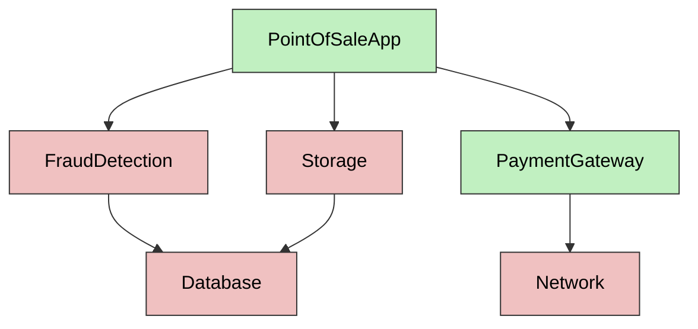

# Different Kinds of Code: Pure, Effects, Providers, Test

[](https://hackmd.io/v4y2FQBoRQuPiXOqNbW7DQ)


There are many ways to categorize code, and no one way is the right way. For our purposes, we will examine it through the lens of testing and categorize it into four main types. Understanding these categories will help you design more testable software. Briefly, these categories are:

* **Pure**: Pure code depends only on its inputs and produces no side effects. It always returns the same output for the same input.
* **Effect**: Side effect (or effect) code (in contrast to pure) depends on global state, or affects global state.
* **Provider**: The provider is responsible for creating a graph of objects.
* **Test**: Test code is used to create the code under test, apply a stimulus, and assert its output.

## Pure

Let’s start with the simplest piece of code for testing, a pure function. A pure function is one whose output depends only on its input; specifically, it does not modify any global state and is therefore side-effect-free.  

Here is an example of a pure function where the output of the function depends only on the function's input:

```ts
function add(a: int, b: int) {
  return a + b;
}
```

If you are doing functional programming, the above definition will suffice, but for object-oriented code, we need to define what pure code is. Pure code is similar to a pure function in that its output depends only on its input, but it can also extend to the concept of objects.

```ts
var map = new Map<string, int>();
map.set("abc", 3);
map.get("abc");
```

The code above is also pure code, because its behavior is identical every time it is invoked. The code does not read or write to the global state. Even though we allocated memory and called `set`, which has a side effect on the `map`, the mutations are contained within the code block because the `map` is allocated and released within it. 

A good way to think about it is to ask: Can multiple copies of the code run concurrently without interfering with each other? 

In our example, the same code can run concurrently because there is no communication channel between different invocations of the block, and therefore the executions are isolated. 

Pure code is easy to test because:

1. Its output only depends on its input.
2. It is safe to execute in parallel with other code/tests.

```ts
function testMap() {
  var map = new Map<string, int>();
  map.set("abc", 3);
  expect(map.get("abc")).toEqual(3);
}
```

## Effect

Above, we described what pure code is. The effect code is essentially all other code. The effect code is code that reads or writes global state. The global state is outside the function's explicit input and output.

> It should be stated that you should minimize global state as much as possible. When discussing the global state, it is worth noting that it exists within your program's execution, usually through static variables. However, there is also a global state outside your program memory, such as the file system, database, network, user inputs, etc. While it should be your goal to minimize the *static variables* (global state), it is not possible for you to minimize the *external global state* (file system, database, user input). As a matter of fact, a program that would not interact with *external global state* would not be useful at all. 

```ts
Math.random();
Date.getTime();
File.read("data.txt");
File.write("data.txt", "Some text");
Environment.get("username");
Config.getSingleton().getAuthKey();
```

Above are examples of “effect” code. Each statement's behavior depends on a hidden state that is read or written to outside the function's explicit input and output. Asking “Can multiple copies of the code run concurrently without interfering with each other?” will result in unpredictable behavior. This unpredictable behavior will make tests hard to write because:

* **Test order matters**: Test A can write to the `output.txt` file, and test B can read from it; running the tests in the wrong order may cause test failure. The test may pass when run in isolation, but fail when run as a set. 
* **Concurrency matters**:  Running the test in parallel will create a flaky test as the interleaving of global state reads and writes can’t be predicted.

It is All About the Global State

One way to think about effect code is that it reads or writes global state.

* `Math.random()`: There is a hidden global variable that contains the seed of the pseudo-random-number generator. Every time the function is invoked, the seed is updated to the next seed.
* `Date.getTime()`: There is a hidden global variable that contains the current time. The variable increments every millisecond automatically. The function reads the current value to retrieve the current time.
* `File.read(”data.txt”)`: The function behavior is dependent on the content of the data.txt file. A different process can update the file at any time, causing your test to break.
* `File.write(”data.txt”, ...)`: The function updates the content of data.txt. There may be other tests that expect the file to have specific content. 
* `Environment.get(”username”)`: Reading environment variables means that content behavior can be influenced by code outside the test.
* `Config.getSingleton().getAuthKey()`: Reading values from singletons means that the state is shared across many tests. Mutating the value outside what the test expects will result in failure. 

Reading data from the database means the database must be in the correct state for our test to pass. Similarly, writing data to the database may break another test down the line by altering the test's initial conditions. 

A lot of discussion about making code testable focuses on managing global state in your application, so you can reason about your code in a pure way. 

## Providers

You can think of Pure and Effect code as building blocks of your application. The job of providers is to assemble the building blocks into a useful graph. 

Let's imagine a simplified Point-of-Sale Application which 



In the above examples green nodes are Pure and red nodes are Effects. The job of the Provider is to assemble the objects into a cohesive graph which performs useful work. It may be tempting to think there is only one useful way to assemble your application, but in fact, there are many ways depending on the environment. Here are some examples:

* **Production**: This is the most obvious way to assemble the application, to perform its intended use.
* **Staging**: This is similar to **Production**, but we replace the `Database` with `StagingDatabase`. 
* **Server**/**Client**: Many applications are server/client, and therefore we may replace `Storage` with `HttpStorageProxy`.
* **Unit Tests**: In unit-tests we often want small subset of application to be instantiated. For example when testing `PaymentGateway` we use `MockNetwork` and ignore the rest of the application.
* **End-to-end tests**: In End-to-end tests we instantiate with `InMemoryDatabase` and `MockGateway`.

Here is an example of a provider function assembling the application:
```ts
function pointOfSaleAppProvider() {
  var network = new Network(...);
  var gateway = new PaymentGateway(network);
  var db = new Database(....);
  var storage = new Storage(db);
  var fraudDetection = new FraudDetection(db);
}
```
Notice that the creation of application and wiring all the pieces allocate memory, but perform no work. This is important as we don't want the creation to kick of side effects. To see how side effects are kicked off see what an ideal `main()` method looks like:

```ts
function main() {
    // Create the graph phase
    var app = pointOfSaleAppProvider(); // <=== Creation only! No side effects.

    // do useful work phase
    app.run(); // <=== Side effects happen here
}
```

## Test

Finally, we need Test code to exercise 