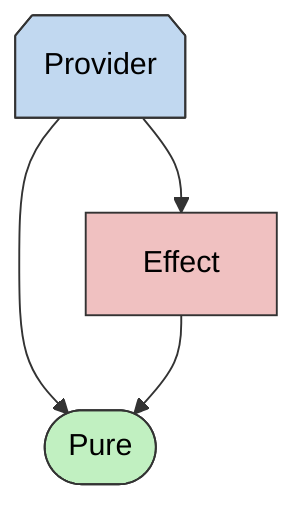
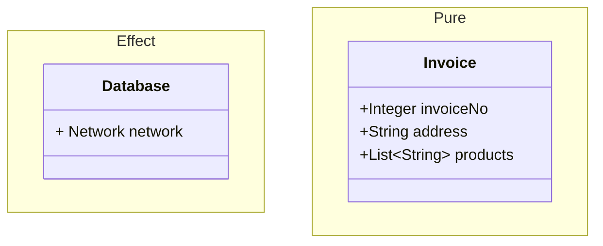
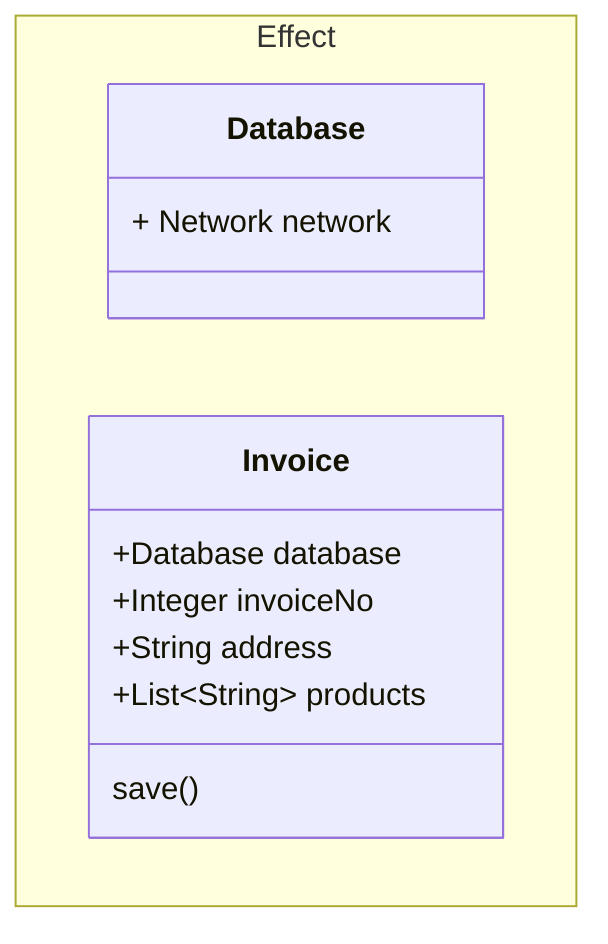
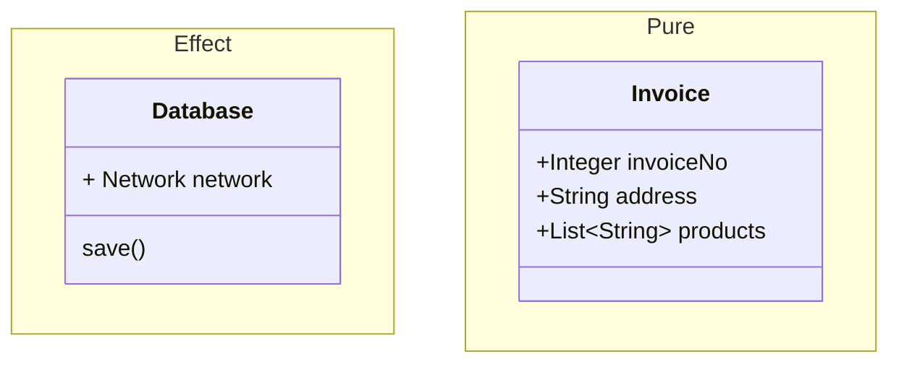

# Compile Dependencies

Let's discuss how we should think about code concerns from the perspective of compile-time dependencies.

Code concerns should be layered:
  - Provider code is at the top of the dependency graph. It is allowed to depend on other Providers, Effects, and Pure code.
  - The Effect code is in the middle of the dependency graph. It is allowed to depend on other Effects and Pure code. The Effect code is not allowed to depend on the Provider code.
  - The Pure code is only allowed to depend on other Pure code. It is not allowed to depend on the Effect or the Provider code.

>  🔷 (blue) Provider code ; 🟥 (red): Effect code; 🟢 (green) Pure code

## Why can't Pure depend on Effect

I think these rules are best explained by analogy: It would be weird if `String` (Pure) would have compile-time dependency on `Database` (Effect). But it is expected that a `Database` (Effect) would have a compile-time dependency on `String` (Pure).

Another way to think about this is that if `String` (Pure) depends on `Database` (Effect), then `String` is no longer Pure; the string now has side Effects. Pure is more restrictive than Effect because it does not allow an external state. If Pure depends on Effect, then there is a code path in Pure code that depends on external state; hence, the Pure code is now tainted and is no longer Pure. The Effect code is poisoned with external state. If you depend on the poisoned code, you too will become poisoned.

> The moment Pure code depends on Effect code, it ceases to be Pure, and it becomes an Effect.

### Common pitfalls

While it is obvious that `String` should not depend on database, developers often get in trouble when they create their own classes. Let's say we create an `Invoice` class. Is `Invoice` Pure or Effect? I would expect that `Invoice` would be Pure, because the purpose of such a class would be to store the data related to an invoice by internally depending on `List`, `String`, etc. which are all Pure. Additionally, we will have a `Database` class which is Effect for persisting your `Invoice`.

The place where devs go wrong is by adding a `save()` method. Where should `save()` be placed? Most developers will put it on the `Invoice` like so:

But notice, what just happened, by placing the `save()` method on `Invoice` the `Invoice` changes in these ways:
- The `save()` method now needs access to the `database`, so we have to add a field of type `Database`
- We have now created a compile-time dependency on `Database`.
- The `Database` Effect has poisoned the `Invoice` Pure code. 
- Notice that `Database` is no longer Pure, it is now Effect.

It may feel a bit counter-intuitive but the correct place to add `save()` method is on `Database` like so:

By placing `save()` on `Database` the `Invoice` remains Pure. But most developers will protest that the object should know how to save itself, so let me provide some real world analogies which will dispel this.
- Have you ever seen a letter which knows how to mail itself? (It knows how to route itself through post offices to get to destinations?) No, the post office act on the letter to get it to the destination.
- Document's don't know how to print themselves, the printers know how to print documents. 
- Car's don't know how to assemble themselves, assembly lines in factories know how to assemble cars.

### Why is Poisoning Pure Code Problematic

We discussed the importance of not having Pure code having a compile-time dependency on Effect, but why is this a problem? 

> NOTES
> 1. Expectations: It is easier to reason about Pure code. This is why functional languages focus on pure code so much.
> 2. Effect Coupling: Tests need to be able to replace Effect code with Mocks or Friendlies. Having Pure code depend on Effect makes construction a lot more complicated, [see: Dependency Injection]
>3. Writing tests becomes a lot more complicated. ()

## Why can't Effect depend on Provider

The job of the P

## What if Pure code needs to depend on Effect or Providers?

---

> NOTES
> - when looking at code guess which type it is and see if it breaks rules.